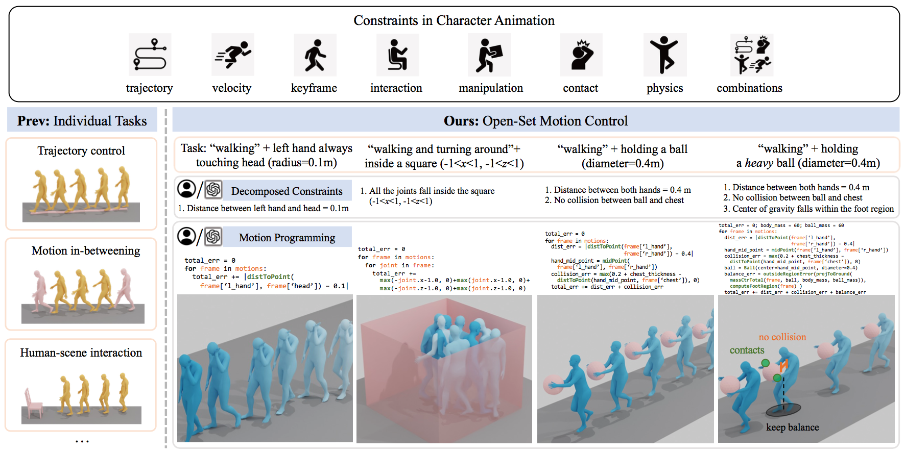

# Programmable Motion Generation for Open-Set Motion Control Tasks (CVPR24)


This is the code for the paper [**"Programmable Motion Generation for Open-Set Motion Control Tasks"**]() (CVPR24 Highlight). 

[**arXiv version**](), 
[**supplementary video**](assets/supplementary_video.mp4)



## Getting started

#### 1. Setup environment
Follow the instruction of [PriorMDM](https://github.com/priorMDM/priorMDM) (or [MDM](https://github.com/GuyTevet/motion-diffusion-model)) to create a conda environment and install necessary packages in order to use the MDM model.


#### 2. Download necessary data files

The data files required for running experiments are the same as [MDM](https://github.com/GuyTevet/motion-diffusion-model). We place them separately under a directory `${ROOT_DIR}`. The required files include:

- pretrained MDM model: `model000475000.pt` and `args.json`. Available at [MDM](https://github.com/GuyTevet/motion-diffusion-model) (HumanML3D humanml-encoder-512 (best model)).
Replace `MODEL_PATH` in scripts `ProgMoGen/script_demo/*.sh` and `ProgMoGen/script_eval/*.sh`
with your own path.

- CLIP model: `ViT-B-32.pt`. Available at CLIP (https://github.com/openai/CLIP/blob/main/clip/clip.py)

- glove: Download files from `ProgMoGen/prepare/download_glove.sh` and place the directory under `${ROOT_DIR}`.

- dataset: get directory `motion-diffusion-model/dataset` from [MDM](https://github.com/GuyTevet/motion-diffusion-model) and place it under `${ROOT_DIR}`. Download `t2m` from `ProgMoGen/prepare/download_t2m_evaluators.sh` and place it under `${ROOT_DIR}`. 

- body_models: Download files from `ProgMoGen/prepare/download_smpl_files.sh` (a folder named `body_models`) and place it under `${ROOT_DIR}`. 

Change paths in `ProgMoGen/config_data.py`.


#### 3. Get HumanML3D data
Follow the instruction and data preprocessing steps [HumanML3D](https://github.com/EricGuo5513/HumanML3D.git) to prepare HumanML3D dataset. We also provide `Mean.npy`, `Std.npy` in the directory `ProgMoGen/my_data/HumanML3D`.

Place HumanML3D folder under `${ROOT_DIR}/dataset`, as `${ROOT_DIR}/dataset/HumanML3D`

#### 4. Our data for experiments

Copy `test_all_id.txt` and `test_plane_v0_id.txt` in `ProgMoGen/my_data` to `${ROOT_DIR}/dataset/HumanML3D`. They are subsets of the test split used in our evaluation.

Other data files with texts and constraints for quantitative experiments are also provided in `ProgMoGen/my_data`.


After these steps, the data will be organized as following
```
${ROOT_DIR}
|-- glove
|-- body_models
     |-- smpl
|-- t2m
|-- dataset
     |-- humanml_opt.txt
     |-- t2m_mean.npy
     |-- t2m_std.npy
     |-- HumanML3D
          |-- Mean.npy
          |-- Std.npy
          |-- test_all_id.txt
          |-- test_plane_v0_id.txt
          |-- new_joint_vecs


${MODEL_PATH}
|--model000475000.pt
|--args.json
```


#### 5. Install blender for visualization

We use blender code from project [TEMOS](https://github.com/Mathux/TEMOS) for visualization. Follow the [instruction](https://github.com/Mathux/TEMOS) to install blender and bpy dependencies.
Replace `blender_app` path in `ProgMoGen/script_demo/*.sh` with your own path to blender application.


## Project structure
```
ProgMoGen
  |--diffusion          # ddim
  |--atomic_lib         # atomic constraint library
  |--script_demo        # run demo in Figures
  |--script_eval        # run evaluation in Tables
  |--task_configs       # define error function and optimization parameters for demo.
  |--task_configs_eval  # define error function and optimization parameters for evaluation.
  |--tasks              # main program
  |--eval               # quantitative evaluation
  |--my_data
  |--config_data.py
  ...
TEMOS-master
  |--render_demo_*.py   # main rendering program for each task
  |--temos
       |--render
            |--blender
                 |--render_*.py  # draw scenes
```

## Demo
We provide scripts in `ProgMoGen/script_demo` for runnning examples presented in the paper. The script will generate `gen.npy`, fit smpl body sequences and render images and videos using blender.

Results will be saved to `save_fig_dir` and you can change in the script on your own. 

```
cd ProgMoGen
```

Motion Control with High-order Dynamics
```bash
sh script_demo/run_demo_hod1.sh
```

Motion Control with Geometric Constraints
```bash
sh script_demo/run_demo_geo1_relax.sh
sh script_demo/run_demo_geo2_relax.sh
```

Human-Scene Interaction
```bash
sh script_demo/run_demo_hsi3.sh
sh script_demo/run_demo_hsi4.sh
sh script_demo/run_demo_hsi5.sh
```

Human-Object Interaction
```bash
sh script_demo/run_demo_hoi1.sh
sh script_demo/run_demo_hoi2.sh
```

Human Self-Contact
```bash
sh script_demo/run_demo_hsc1.sh
```

Physics-based Generation
```bash
sh script_demo/run_demo_pbg1.sh
sh script_demo/run_demo_pbg2.sh
```

Motion programming by GPT
```bash
sh script_demo/run_demo_hsi3_gpt.sh
sh script_demo/run_demo_hsi4_gpt.sh
```

Other examples
```bash
sh script_demo/run_demo_directional.sh
sh script_demo/run_demo_or.sh
```


For any other open-set tasks, just write a `task_config.py` with customized `f_loss` and `f_eval`, assign appropriate optimization parameters and feed to `--task_config ${task_config}`.

We also implemented a simple framework for constraint relaxation. Refer to `run_demo_geo1_relax.sh` and `run_demo_geo2_relax.sh` for more details.

## Evaluation
We provide scripts in `ProgMoGen/script_eval` for quantitative evaluation presented in the paper. The script will generate `gen.npy`, and calculate metrics using evaluation code in `ProgMoGen/eval`.

Results will be saved to `save_fig_dir` and you can change in the script on your own.

```
cd ProgMoGen
sh script_eval/eval_task_hsi1.sh
sh script_eval/eval_task_geo1_relax.sh
sh script_eval/eval_task_hoi1_relax.sh
sh script_eval/eval_task_hsi2.sh
sh script_eval/eval_task_hsi3.sh
```

Scripts for some other baseline methods are also provided.


**Since the optimization for each sample takes several minutes, we run the generation for each sample only once for calcuating evaluation metrics. A set of text prompts and corresponding constraints are pre-defined and provided in `ProgMoGen/my_data`. Also, as the FID score is sensitive to the groundtruth samples selected for calculating statistics, we also provide code to calculate average FID by sampling groundtruth motions multiple times.**


<!---
```bash
sh script_eval/eval_task_hsi1_unconstrain.sh
sh script_eval/eval_task_hsi1.sh
sh script_eval/eval_task_hsi1_ik.sh
sh script_eval/eval_task_hsi1_ikreg.sh
sh script_eval/eval_task_hsi1_mdmedit.sh
sh script_eval/eval_task_hsi1_fid_nruns.sh

sh script_eval/eval_task_geo1_relax_unconstrain.sh
sh script_eval/eval_task_geo1_relax.sh
sh script_eval/eval_task_geo1_relax_ik.sh
sh script_eval/eval_task_geo1_relax_ikreg.sh
sh script_eval/eval_task_geo1_relax_mdmedit.sh

sh script_eval/eval_task_hoi1_relax_unconstrain.sh
sh script_eval/eval_task_hoi1_relax.sh

sh script_eval/eval_task_hsi2.sh

sh script_eval/eval_task_hsi3.sh
sh script_eval/eval_task_hsi3_ik.sh
sh script_eval/eval_task_hsi3_ikreg.sh
```
--->


```
sh script_eval/eval_task_hsi1_fid_nruns.sh <gen_npy_file>
```

Results of LLM programming evaluated in the supplementary material are provided in `assets/GPT_programming`.


## Acknowledgements

Our code is heavily built on:
[PriorMDM](https://github.com/priorMDM/priorMDM),
[MDM](https://github.com/GuyTevet/motion-diffusion-model),
[TEMOS](https://github.com/Mathux/TEMOS) and 
[GMD](https://github.com/korrawe/guided-motion-diffusion/). 
We thank them for kindly releasing their code.

#### Bibtex
If you find this code useful in your research, please cite:

```
@inproceedings{
,
title={Programmable Motion Generation for Open-Set Motion Control Tasks},
author={},
booktitle={},
year={2024},
url={}
}
```


## License
This code is distributed under an [MIT LICENSE](LICENSE).

Note that our code depends on other libraries, including CLIP, SMPL, SMPL-X, PyTorch3D, and uses datasets that each have their own respective licenses that must also be followed.